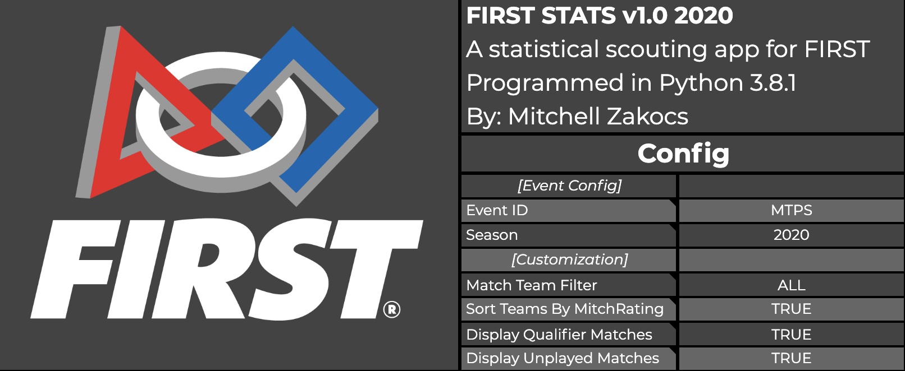
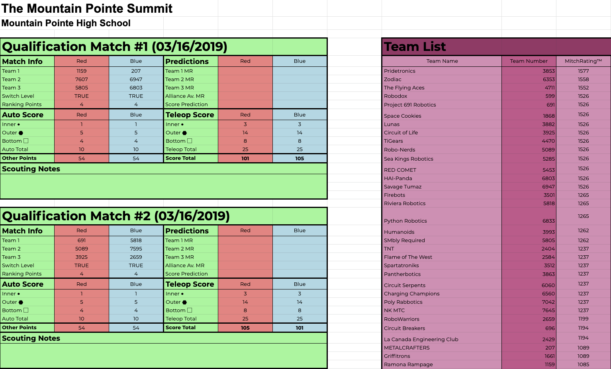

# FIRSTStats2020
> A statistics prediction engine for 2020 FIRST Robotics.

In previous seasons of FIRST, our team used a complicated and messy spreadsheet for event scouting and for match predictions. Our prediction algorithm was rudimentary and extremely innacurate, and we wanted something that was more automated and higher quality than the excel file we were using before. I made this project to automate a great portion of the scouting process by pulling data from the FIRST API and making it look a lot better in the process. The project is also completely integrated with Google Sheets instead of a spreadsheet, making it much easier to view data, edit notes and configure the app from any web browser.
This app is meant to be run as a service on a server or a computer and ran constantly, but can be modified as a one-time-run application if you remove the main execution loop and just call the functions once.

## Classes

* main.py
    * main: Main execution loop for the sheets and class object definitions
    * MatchData: Gets match, event and team data from the FIRST API
* firstsheets.py
    * Sheets: Main class for uploading information, formatting,and modifying the google sheet
    * UCSQP: Stands for Universal Compressed Sheets Query Protocol, allows us to bypass the 100 requests per 100 seconds limit on the Google Sheets API by grouping multiple requests into 1
* firstpredictions.py
    * Match: Created for each match in an event, has functions like updating teams scores in each match and listing teams in the match
    * Team: Created for each team in an event, stores team score data and runs predictions on it using the GLICKO rating system and score averages
* firstconfig.py
    * FirstConfig: Gets config data from the google sheets and stores it in config.ini

## Release History

* 1.0
    * In development

## Meta

Mitch Zakocs – mitchell.zakocs@pridetronics.com

Distributed under the MIT License. See ``LICENSE`` for more information.

[https://github.com/zakocsm/](https://github.com/zakocsm/)

## Contributing

1. Fork it (<https://github.com/zakocsm/FirstStats2020>)
2. Create your feature branch (`git checkout -b feature/fooBar`)
3. Commit your changes (`git commit -am 'Add some fooBar'`)
4. Push to the branch (`git push origin feature/fooBar`)
5. Create a new Pull Request